# 🍜 Food Stall Review App

A mobile application that helps users discover food stalls, view stall information, submit reviews, and manage their review history.

This application was developed as a university group project using React Native. The overall project also uses an Express.js backend and MongoDB Atlas for data storage.

## 📱 Application Screenshots

### Main Application

<p align="center">
  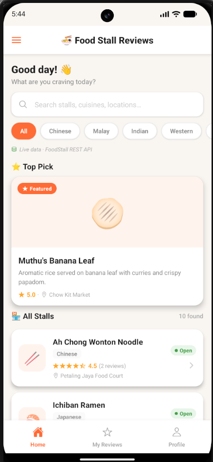
  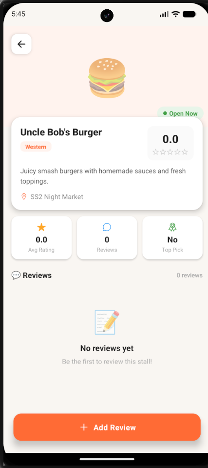
  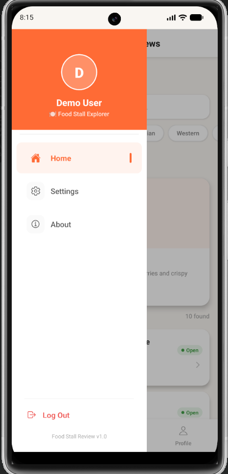
</p>

<p align="center">
  <b>Main Page</b>&nbsp;&nbsp;&nbsp;&nbsp;&nbsp;
  <b>Stall Details</b>&nbsp;&nbsp;&nbsp;&nbsp;&nbsp;
  <b>Navigation Menu</b>
</p>

### Review System

<p align="center">
  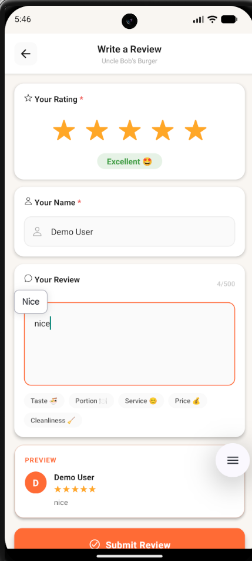
  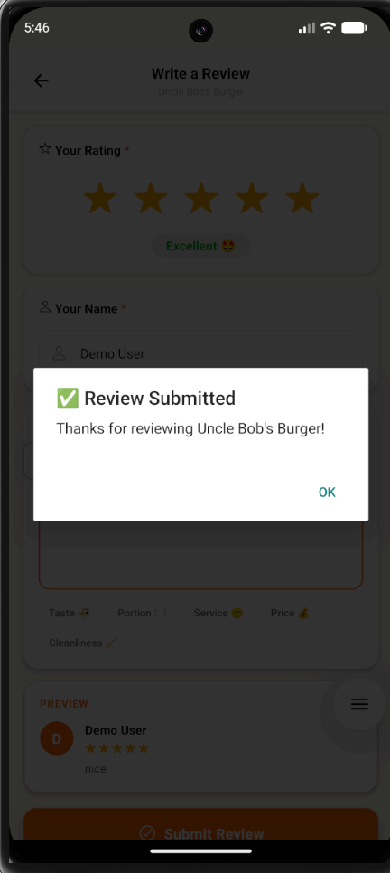
  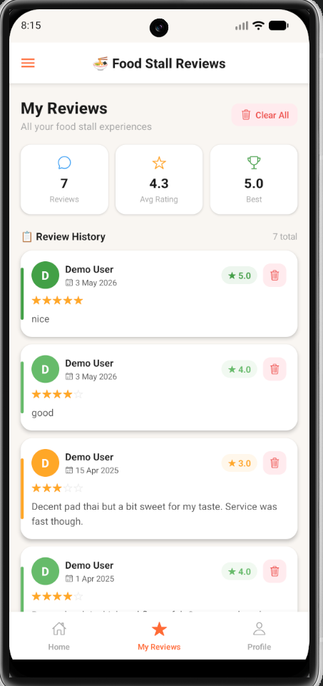
</p>

<p align="center">
  <b>Add Review</b>&nbsp;&nbsp;&nbsp;&nbsp;&nbsp;
  <b>Review Added</b>&nbsp;&nbsp;&nbsp;&nbsp;&nbsp;
  <b>Review History</b>
</p>

### User Account

<p align="center">
  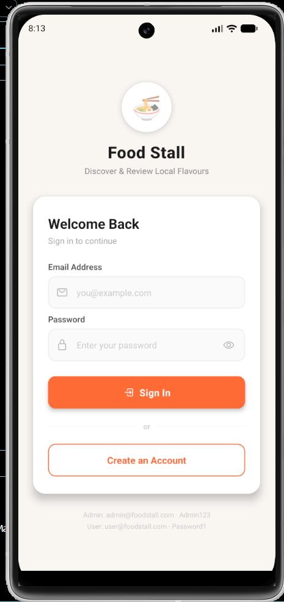
  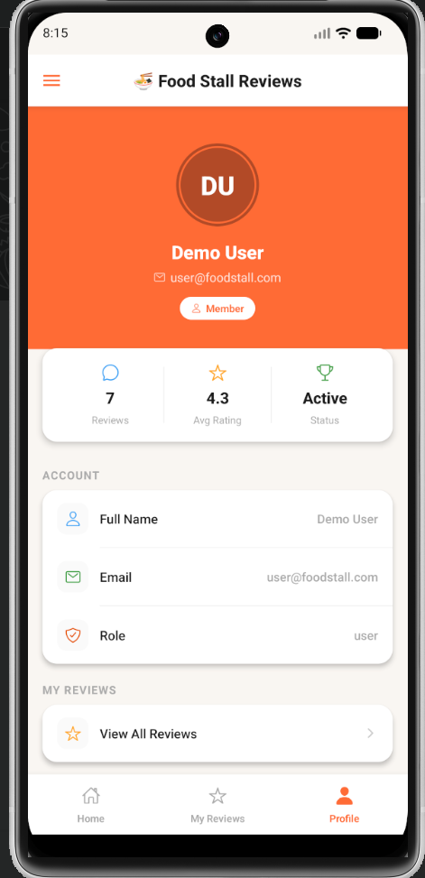
  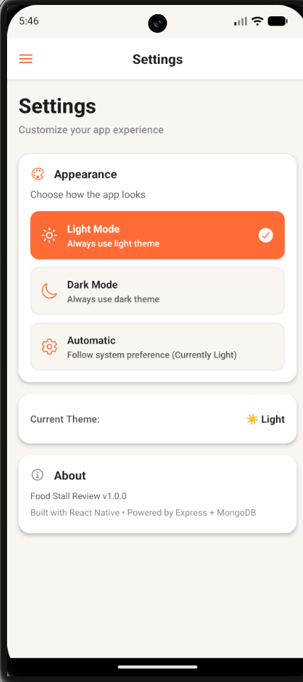
</p>

<p align="center">
  <b>Login</b>&nbsp;&nbsp;&nbsp;&nbsp;&nbsp;
  <b>User Profile</b>&nbsp;&nbsp;&nbsp;&nbsp;&nbsp;
  <b>Settings</b>
</p>

### Dark Mode

<p align="center">
  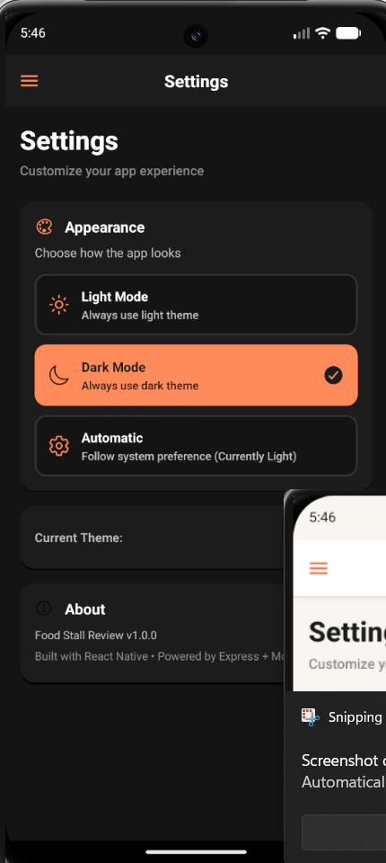
  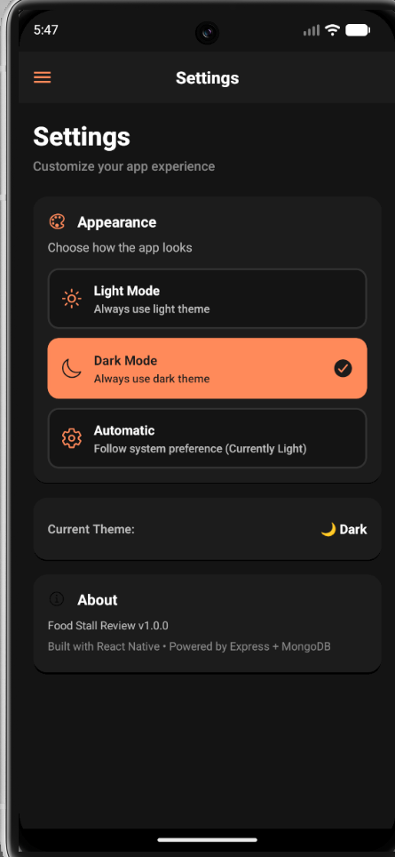
  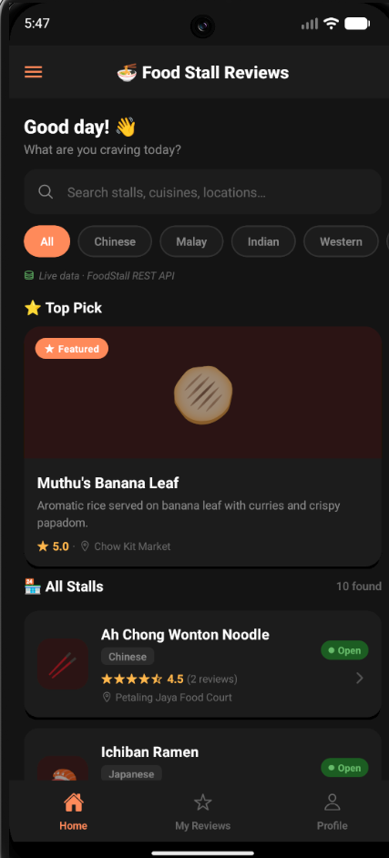
</p>

## ✨ Main Features

* Browse available food stalls
* View food stall information and details
* Submit ratings and written reviews
* View reviews submitted by other users
* Access personal review history
* Register and log in to a user account
* Manage user profile information
* Navigate between different application sections
* Switch between light mode and dark mode
* Store and retrieve application data through the backend

## 🛠️ Technologies Used

### Mobile Application

* React Native
* JavaScript
* AsyncStorage
* React Navigation

### Backend and Database

* Express.js
* Node.js
* MongoDB Atlas
* Mongoose
* REST API

### Development Tools

* Visual Studio Code
* Android Studio
* GitHub
* Figma

## 🏗️ Application Structure

The application consists of three main parts:

1. **React Native mobile application**
   Provides the user interface and allows users to interact with food stall and review features.

2. **Express.js backend**
   Processes requests sent by the mobile application and manages the application’s backend operations.

3. **MongoDB Atlas database**
   Stores application information such as food stall details, user information, and reviews.

The simplified application flow is:

```text
React Native Application
          ↓
     Express.js API
          ↓
     MongoDB Atlas
```

## 👩‍💻 My Contribution

This application was completed as a group project. My main contributions were in prototype design, review-related features, and functional testing.

### 1. Prototype and UI Ideas

During the initial design stage, I contributed ideas for:

* The application layout
* User interaction flow
* Food stall information pages
* Review-page design
* Navigation between application sections
* The overall user experience

### 2. Review-Related Features

I contributed to the application’s review-related functionality and user interface.

My work included:

* Working on review-related screens
* Supporting the review submission flow
* Checking that user reviews were displayed correctly
* Working with review input and user interactions
* Helping improve the usability of the review features

### 3. Functional Testing

I performed functional testing, particularly for review-related features.

My testing work included:

* Testing review submission
* Testing the display of submitted reviews
* Checking different user inputs and scenarios
* Testing navigation between relevant screens
* Identifying unexpected application behaviour
* Helping troubleshoot and verify resolved issues
* Confirming that the features behaved as expected

### 4. Backend and Database Exposure

The Express.js backend, REST API, and MongoDB Atlas database were mainly handled by other group members.

Through working on this project, I gained exposure to:

* How a React Native frontend communicates with a backend
* How the application sends and receives data
* The purpose of REST API endpoints
* How MongoDB Atlas stores application data
* How frontend features depend on backend and database operations

## 📁 Project Structure

```text
food-stall-review-app/
├── android/
├── api/
├── components/
├── ios/
├── models/
├── navigation/
├── screens/
├── screenshots/
├── theme/
├── __tests__/
├── App.tsx
├── config.js
├── generateDatabase.js
├── index.js
├── service.js
├── package.json
└── README.md
```

## 🚀 How to Run

### Requirements

Before running the project, install:

* Node.js
* npm
* Android Studio
* An Android emulator or physical Android device
* React Native development environment

### 1. Clone the repository

```bash
git clone https://github.com/Sinyen24/food-stall-review-app.git
```

### 2. Enter the project folder

```bash
cd food-stall-review-app
```

### 3. Install the dependencies

```bash
npm install
```

### 4. Configure the server address

Open `config.js` and check the server address.

For an Android emulator:

```javascript
const config = {
  serverPath: 'http://10.0.2.2:5000',
};
```

For a physical Android device, replace the address with the local IP address of the computer running the backend.

Example:

```javascript
const config = {
  serverPath: 'http://192.168.1.x:5000',
};
```

The mobile device and computer must be connected to the same network.

### 5. Configure the database

Create the required environment configuration for the MongoDB Atlas connection.

For security reasons, database usernames, passwords, and connection credentials should not be committed to GitHub.

### 6. Start the backend server

```bash
npm run server
```

### 7. Start React Native Metro

Open another terminal and run:

```bash
npm start
```

### 8. Run the Android application

Open another terminal and run:

```bash
npm run android
```

## 🧪 Testing

The application includes Jest configuration for testing.

Run the available tests using:

```bash
npm test
```

Functional testing was also performed manually by checking:

* User inputs
* Review submission
* Review display
* Navigation
* Application responses
* Different usage scenarios

## 📚 What I Learned

Through this group project, I gained practical experience in:

* Developing features in a React Native project
* Working with JavaScript
* Designing mobile application interfaces
* Building user-friendly navigation and interaction flows
* Performing functional testing
* Identifying and troubleshooting software issues
* Collaborating with group members
* Using GitHub to manage project files
* Understanding basic frontend-backend communication
* Understanding the purpose of REST APIs
* Gaining exposure to Express.js and MongoDB Atlas

## 📌 Project Information

* **Project Type:** University group assignment
* **Platform:** Android mobile application
* **Primary Framework:** React Native
* **Main Language:** JavaScript
* **My Main Responsibilities:** Prototype ideas, review-related features, and functional testing

## 📄 Disclaimer

This repository is maintained as an academic portfolio project. The application was developed collaboratively by a group of students. The contributions described above represent my individual involvement in the project.

## 📜 License

This project is available for educational and portfolio purposes.
