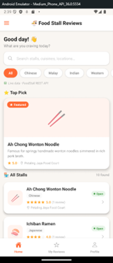
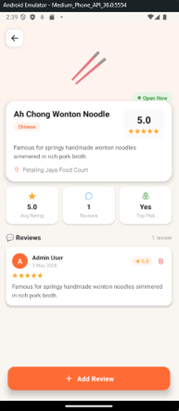
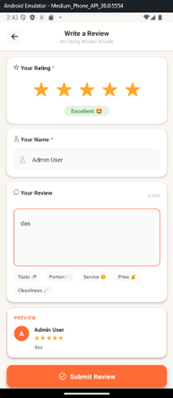
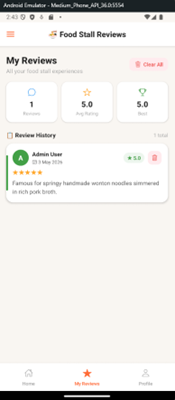
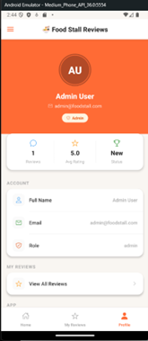

Food Stall Review App
# Project Overview

## 📱 Application Screenshots

### User Features

  
  
  

  <b>Home Page</b> &nbsp;&nbsp;&nbsp;&nbsp;&nbsp;&nbsp;&nbsp;&nbsp;
  <b>Stall Details</b> &nbsp;&nbsp;&nbsp;&nbsp;&nbsp;&nbsp;&nbsp;&nbsp;
  <b>Add Review</b>

  
  

### Admin Features

  

  <b>Manage Stalls — Admin</b>

The Food Stall Review App is a mobile application developed as a group project to help users discover food stalls, view stall information, and share their dining experiences through reviews.

The application was developed using React Native for the mobile application, Express.js for the backend API, and MongoDB Atlas for database management. The project focuses on providing users with a simple platform to browse food stalls, view reviews, and contribute their own feedback.

# Technologies Used
React Native – Mobile application development
Express.js – Backend REST API
MongoDB Atlas – Database
JavaScript – Application and backend development
GitHub – Version control and project collaboration

# My Contribution

As a member of the development team, I was mainly responsible for the Review System and Testing of the application. I also contributed design ideas during the initial prototyping stage.

1. Prototype Design

At the beginning of the project, I contributed design ideas for the initial prototype, including ideas for the user interface and how users could interact with the food stall and review features.

I participated in discussions on the application's layout, user flow, and overall functionality to help establish the initial direction of the application before development.

2. Review System

I was responsible for developing the review functionality, which allows users to provide feedback on food stalls.

My work included:

Implementing the review-related functionality
Handling user-submitted review information
Connecting the review functionality with the backend
Working with the database to store and retrieve review data
Ensuring that reviews were displayed correctly within the application
3. Testing

I was also responsible for testing the application, particularly the review-related functionality.

My testing work included:

Testing review submission and display
Checking different user inputs and scenarios
Identifying and debugging issues
Verifying that the review functionality worked correctly with the backend and database
Performing functional testing to ensure the application behaved as expected

#Project Outcome

Through this project, I gained practical experience in mobile application development, backend API integration, database interaction, software testing, and collaborative software development. I also gained experience working with GitHub and contributing to a group-based software project.
